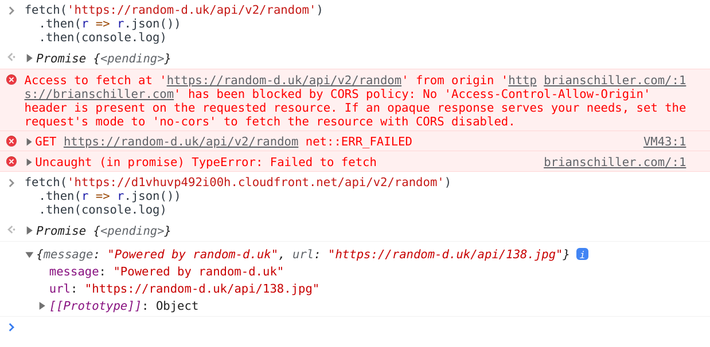

# Cloudfront CORS Proxy

Quickly set up a proxy to add permissive CORS headers to an API you'd like to access.

Learn more at https://brianschiller.com/blog/2021/10/01/avoiding-cors-with-a-proxy

## Quick Start

1. Clone down this repo and edit bin/cloudfront-cors-proxy.ts to point to the API origin you want to proxy to.
2. `npm install`
3. Make sure you have aws access key and secret keys available. An easy way to check is to run `aws configure list`.
3. Bootstrap `npm run cdk bootstrap` (I don't know what this is for)
4. Deploy `npm run cdk -- deploy --all`

```
$ npm install
$ vim bin/cloudfront-cors-proxy.ts # update `originToHit` and any other options you need
$ npm run cdk bootstrap
$ npm run cdk -- deploy --all
...
... lots of output and a couple of security prompts.
...
 ✅  cors-proxy-random-duck

Outputs:
cors-proxy-random-duck.distributionid = E1SFFWMM5DG8ZF
cors-proxy-random-duck.domainname = d1vhuvp492i00h.cloudfront.net
cors-proxy-random-duck.message = Access random-d.uk without CORS restrictions using d1vhuvp492i00h.cloudfront.net as a proxy
```

And we can try it out in a browser to see it working. This screenshot shows browser logs listing CORS errors when requesting random-d.uk directly, but a successful request when using the cloudfront proxy.



## Useful commands

 * `npm run build`   compile typescript to js
 * `npm run watch`   watch for changes and compile
 * `npm run test`    perform the jest unit tests
 * `npm run -- cdk deploy --all`      deploy this stack to your default AWS account/region
 * `cdk diff`        compare deployed stack with current state
 * `cdk synth`       emits the synthesized CloudFormation template
